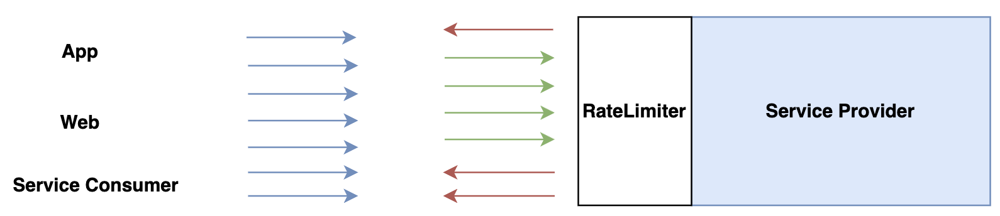
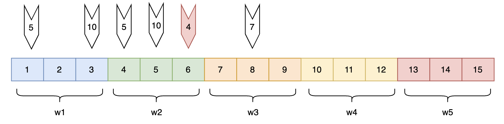
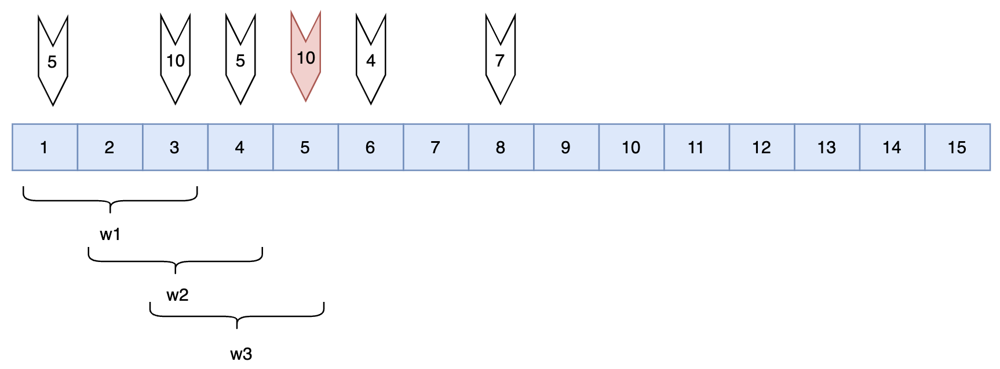
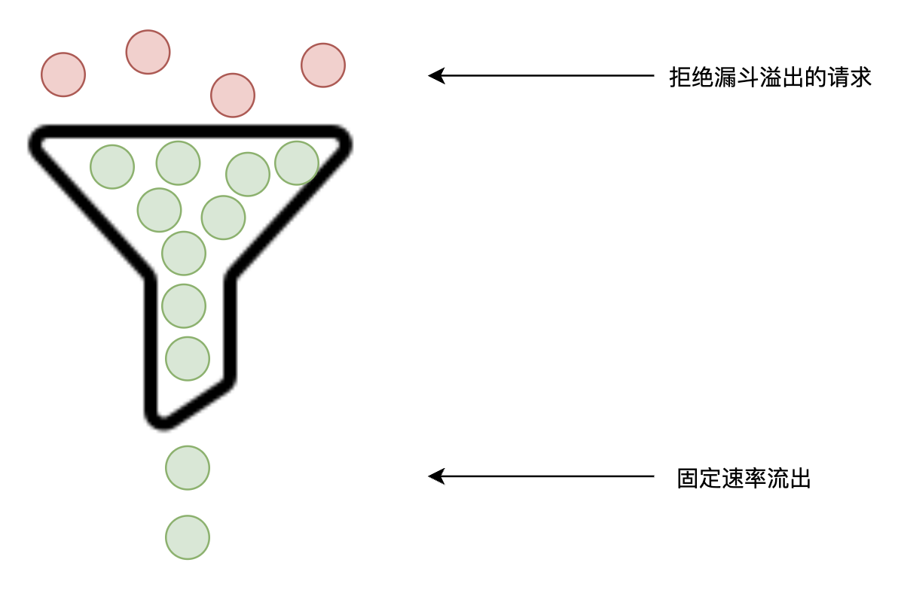
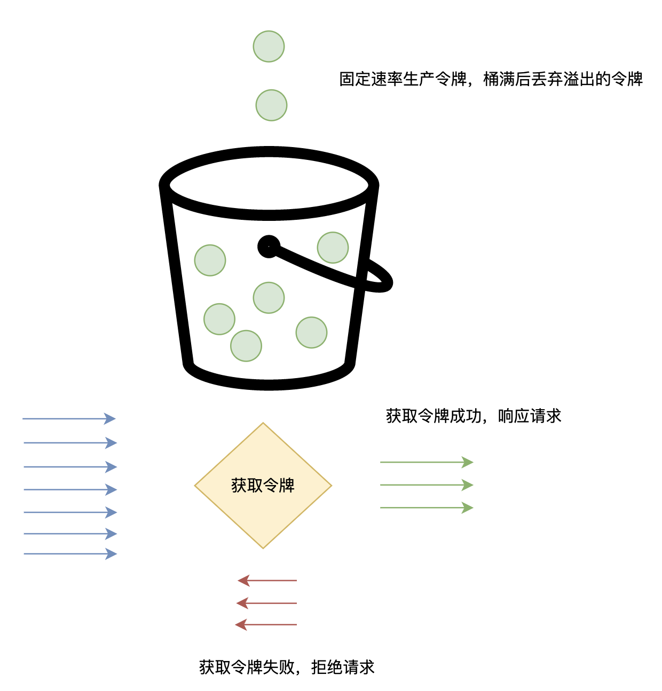
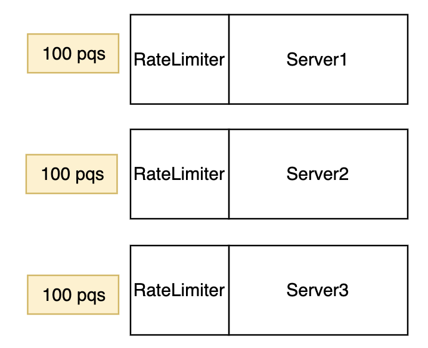
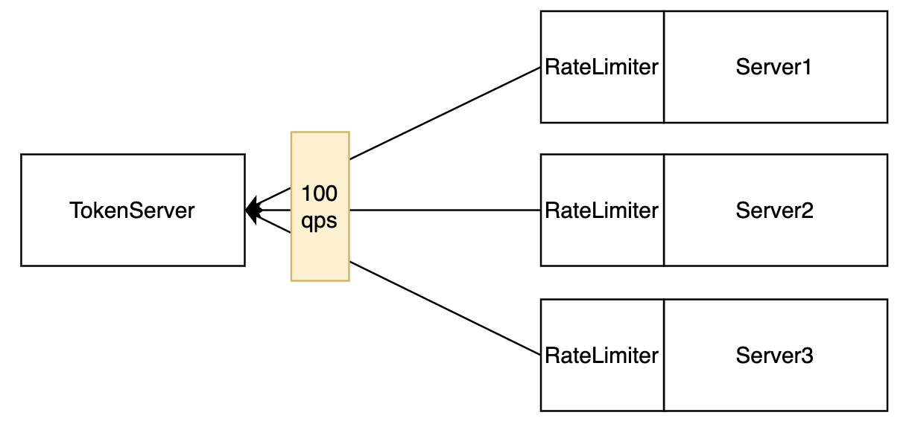

# 访问限流

[English](./limiter.md) | 简体中文

---

# 1. 定义
服务限流是成本最低、可操作性最高的一种服务自我保护措施，防止被流量洪峰击垮。突发流量常见的场景包括：业务活动、突发社会性事件、恶意攻击、爬虫等。
服务通过压测等手段评估出流量容量上限，并在上限的基础上预留 Buffer。评估容量上限后，为服务设置限流规则，超过阈值的请求则直接拒绝服务，直接返回相应的异常或者状态码。
# 2. 限流模型
限流模型如下图所示，限流器根据一定的限流规则以及限流算法判断一个请求是直接拒绝还是透传给后端服务。

## 2.1 限流算法

根据不同的业务场景有对应的算法，常见的有以下几种。

### 2.1.1 固定窗口计数器算法

固定窗口计数器是最常见也是最容易理解的算法。如上图所示，每3秒为一个固定独立统计窗口，一个窗口3秒内，只要请求数不超过阈值的请求都能正常响应，超过阈值的部分则拒绝。假设一个窗口设置的阈值为 15，则上图中红色箭头部分为被拒绝的请求。

**弊端**

固定窗口最大的问题在于两个窗口的交汇处，会出现请求数超出阈值的情况。例如上图所示，第3秒和第4秒由于在两个独立的窗口，所以都没有超过 15 的阈值，请求正常通过。但是在第3,4,5秒这三秒窗口内，一共有 25个请求通过，这其实是不符合本意。

### 2.1.2 滑动窗口计算器算法（常用）

滑动窗口是对固定窗口弊端的改良。

滑动窗口将一个时间窗口划分为若干个时间窗格单元，每个时间窗格单元代表固定的时间段（如1s），滑动窗口拥有独立的计数器，每过一个时间窗格就向前滑动一格。一个滑动窗口内不能超过阈值。
以上图为例，转化为固定窗口就是 [1,2,3] 为一个固定窗口，[2,3,4] 为一个固定窗口，[3,4,5] 为一个窗口 ... 这样就能避免固定窗口的弊端。在 [3,4,5] 窗口里，由于3,4已经超过阈值，第5秒的请求则会被拒绝。但是在 [4,5,6] 窗口里，由于第5秒的10个请求被拒绝，所以第6的请求能正常访问。
根据以上推演，滑动窗口能够准确表达 3秒内15个请求阈值的语义。

### 2.1.3 漏桶算法

不管是固定窗口计数器还是滑动窗口计数器算法，都存在一个问题。那就是当一个窗口内，如果窗口起始阶段就已经达到阈值，会导致先忙后先闲的情况。而漏桶算法最大的改进点在于可以匀速处理请求。
以一个实例场景为例，假设漏桶容量是 15，开始时漏桶是空的，这时候突然进入30个请求，则前面15个请求进入漏桶，后15个请求由于漏桶满而被直接拒绝。假设漏桶固定速率为每秒5个请求，那将会在3秒内处理完漏斗内的15个请求。在3秒的周期内匀速处理请求。

**适用场景**

漏桶算法的出水速度是恒定的，那么意味着如果瞬时大流量的话，将有大部分请求被丢弃掉（也就是所谓的溢出）。漏桶算法通常可以用于限制访问外部接口的流量，保护其他人系统，比如请求银行接口，通常要限制并发数。

### 2.1.4 令牌桶算法（常用）

令牌桶算法跟漏斗算法区别在于令牌桶算法会以固定速率向桶里生产令牌，当请求进来时，从桶里获取令牌，如果获取令牌成功则响应请求，否则拒绝请求。如果请求里少，桶被装满后，则丢弃溢出的令牌。
令牌桶算法和漏斗算法都具备在请求量大的情况下，达到匀速处理请求的效果。但是还是有区别的，以上述例子为例，假设令牌生产速率为5个每秒，在第一秒桶里一共有5个令牌，此时突发收到30个请求，则只有5个请求能正常响应，25个请求被丢弃。

**和漏桶算法的区别**

令牌桶算法生成令牌的速度是恒定的，而请求去拿令牌是没有速度限制的。这意味，面对瞬时大流量，该算法可以在短时间内请求拿到大量令牌，可以处理瞬时流量，而且拿令牌的过程并不是消耗很大的事情。令牌桶算法通常可以用于限制被访问的流量，保护自身系统。

# 3. 限流规则策略

## 3.1 限流粒度

### 3.1.1 服务级限流
对整个服务配置一份限流规则，例如限制 UserService 所有接口整体 QPS 为 1000.

### 3.1.2 接口级限流
对一个服务里的某个特定接口限流，例如限制 UserService.queryUser 接口 QPS 为 1000.

## 3.2 请求过滤
只对满足特定条件的请求配置限流策略，例如：

1. 对来自特定的下游服务进行限流，常用于某个服务过来的突发流量
2. 对非 VIP 客户的请求进行限流，从而优先保证 VIP 客户的能力

## 3.3 限流后置处理

当请求命中限流规则之后，对请求的处理方式，常见的有以下几种方式：

### 3.3.1 快速失败

立刻返回一个异常或者限流状态码给主调端。

### 3.3.2 匀速排队

匀速排队基于令牌桶算法实现，当一个请求拿不到令牌时，等待一段时间，如果等待的过程中可以获取到令牌则继续响应请求，当等待的时间结束后仍然获取不到令牌，则返回异常或者限流状态码。

# 4. 限流执行点

## 4.1 被调端（服务端）

最常见执行限流器是在被调端，用于保护自身服务被突发流量击垮。例如接入层网关、微服务等。

## 4.2 主调端（客户端）

主调端在调用其它上游服务时，设置限流器。常用于保护上游服务被击垮。例如调用第三方合作机构的开发平台接口时，防止击垮第三方服务，则在调用接口时设置限流规则。当然此种场景，如果第三方服务已经具备了限流能力，则无需在主调端设置规则。常用于下游服务没有限流能力时的一种保护手段。

# 5. 限流类型

## 5.1 单机限流

单机限流为使用最广泛的限流类型，一个服务里的每个实例独立执行限流规则，实例之间互不影响。如下图所示，每个实例上限为 100 qps，整个服务的上限则为 100 * 3 = 300 qps。随着服务实例的水平扩容，服务整体的服务能力响应提高。

第三节提到的限流策略均可在单机限流中实现。

## 5.2 集群限流

集群限流是服务所有实例共享限流阈值。如下图所示，整个服务的上限为 100 qps，如果阈值均匀分配到每个实例，则每个实例约 33 qps。集群限流由于需要实例间共享状态，往往需要引入集中式 TokenServer，用于实例间协调阈值。

集群限流常用于以下几种场景：

1. 业务限流。例如开放平台网关限制第三方每天的调用量。
2. 流量不均衡导致整体限流效果偏差。例如集群中有3个实例，每个实例设置 100 qps，那么理论情况下服务整体的阈值为 300 qps。但是如果流量不均衡会导致有些实例触发限流，有些实例则不触发。从而导致整个服务小于 300 qps。
3. 保护上游。例如服务使用了数据库，数据库在规格一定的情况下，能承载的访问量是有限的。随着实例扩容，服务整体的 qps 提高了，但是数据库会成为瓶颈，最终会导致数据库被压垮。所以通过服务集群限流，限制在一个安全的水平，保证数据库的服务能力。

## 5.3 自适应限流

无论是单机限流还是自适应限流，限流阈值都是通过规则设置的一个静态的阈值，例如 100 qps。但是在某些场景下，需要结合实例当前的运行情况动态调整阈值。例如根据当前实例的 Load、CPU使用率、平均 RT、入口 QPS、并发线程数等。通过自适应的限流策略，在保证实例稳定性的前提下，尽可能提高吞吐量。

**指标说明**

- **Load**：根据系统的 Load1、Load5 超过阈值触发系统保护。
- **CPU**：当系统 CPU 使用率超过阈值即触发系统保护。
- **平均 RT**：当实例所有请求平均 RT 达到阈值即触发系统保护。
- **并发线程数**：当实例处理请求的并发活跃线程数达到阈值即触发系统保护。
- **入口 QPS**：当实例所有请求 QPS 达到阈值即触发系统保护。

配置自适应限流规则时，可以配置同时满足以上几个条件时触发自适应限流。例如满足：

1. Load5 大于 4
2. 平均 RT 大于 100ms
3. 并发线程数大于 50

时，调整限流阈值为 100 qps。

