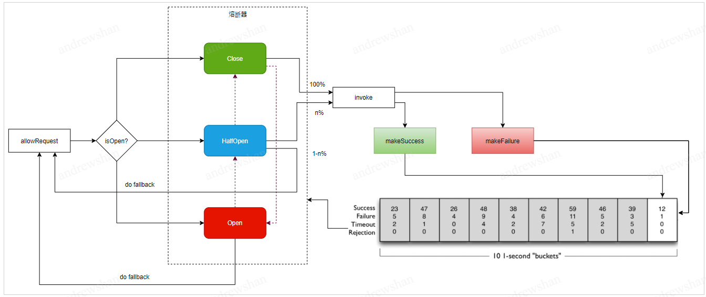

# 熔断降级

[English](./circuitbreaker.md) | 简体中文

---

## 定义

熔断降级，指的是当下游因过载或者BUG等原因，出现请求错误后，为了防止故障级联扩散导致整个链路出现异常，从而对请求进行拒绝或者重试的一种机制。

## 熔断模型

熔断模型的设计遵循业界标准的熔断器模型设计。熔断器有3类状态：

- 关闭：所有请求皆可访问下游资源，无任何限制。
- 打开：限制访问下游资源的请求，不允许任何请求的访问。
- 半开：限制访问下游资源的请求，只允许部分请求达到下游。

## 熔断场景

熔断一般会发生在以下场景下：

### 硬件环境出现故障

服务在运营过程中，因为一些不可抗力的因素，可能会出现机器故障、机器重启、机房断电、网络中断等问题。通过熔断机制，对服务实例或者机房分组的快速熔断，可以避免业务请求持续失败。

### 版本上线引入BUG

版本新特性开发上线后，因为漏测等原因，某些分支触发了BUG，导致部分的业务逻辑出现故障。常见的是部分方法在遇到某些入参的时候，会出现进程报错或者高负载的问题，影响其他方法的请求处理。通过熔断机制，将故障方法进行隔离，可以避免其他业务请求受到影响。

### 服务出现过载

因为路由不均或者峰值流量的到来，导致被调服务出现了高负载，导致请求的时延增大，成功率降低。通过熔断机制，合理的拒绝一部分请求，可以降低服务负载，恢复正常的运行状态。

## 熔断级别

### 服务级熔断

按照服务粒度进行熔断统计，服务一般对应的是注册中心上注册的服务，实际对应到业务可以是应用或者模块。一旦服务被熔断后，访问该服务的请求都会返回失败走降级逻辑

### 方法级熔断

按照服务下提供的方法进行熔断统计，方法被熔断后会对请求进行拒绝或者走降级逻辑。

### 分组级熔断

按照服务实例分组进行熔断统计，实例分组被熔断后，请求往往会重路由到其他实例分组。

### 实例级熔断

按照具体的服务实例进行熔断统计，实例被熔断后，请求往往会重路由到其他实例。

### 组合粒度

按照组合的粒度进行熔断统计，常见的组合是方法+实例的组合，对应的场景是，一个实例提供了多个方法，其中一个方法在新版本上线时候出现了BUG，需要对该实例下对应的方法进行熔断，其他方法没有改动，可以正常提供服务。

## 触发熔断条件

#### 连续错误数熔断

请求调用时，统计周期内，出现连续异常数目超过阈值之后，资源进入熔断状态。
polaris、CloudWeGo已支持。

#### 错误率熔断

熔断器按照滑窗对请求总数及成功数进行统计，并汇总时间段内的总错误率，一旦超过阈值，资源进入熔断状态。
go-zero、polaris、CloudWeGo已支持。

#### 错误数熔断

熔断器按照滑窗对请求总数及成功数进行统计，并汇总时间段内的总错误数，一旦超过阈值，资源进入熔断状态。
CloudWeGo已支持。

#### 慢调用率熔断

熔断器按照滑窗对请求总数及慢调用数进行统计，并汇总时间段内的总慢请求率，一旦超过阈值，资源进入熔断状态。
polaris已支持。

## 熔断策略

业界熔断策略一般归为两类：

- 快速失败熔断：一旦触发熔断，则接下来的熔断周期内对资源的访问会自动地被拒绝或重路由。

  适用于硬件环境出现故障，以及版本上线出现BUG的快速熔断场景。

  代表的算法有[Hystrix](https://github.com/Netflix/Hystrix/wiki)。

- 自适应熔断：出现错误时，会按照错误率的比例，渐进式的丢弃一部分的请求，直到丢弃的请求数无限接近100%（完全熔断）。

  适用于过载保护的场景，可以将流量调整到能正常处理业务请求的范围。

  代表的算法有[谷歌SRE](https://sre.google/sre-book/handling-overload/)

### 快速失败熔断

polaris、CloudWeGo已支持

#### 算法实现

每个请求进入后，会判断熔断器状态，存在3种分支：

- 熔断器打开后，请求直接返回，走降级逻辑。
- 熔断器半开，则只需要一定量的请求访问下游，其他请求返回。
- 熔断器打开，所有请求都可以访问下游。

在请求调用后，通过框架采集请求的调用结果，汇聚熔断器。

熔断器会通过滑窗的方式，统计每个请求的成功数及总请求数，根据成功失败率进行状态转换：

-  熔断器从关闭到打开：一旦请求达到阈值，则熔断器打开。
-  熔断器从打开到半开：熔断器打开经过一段时间，或者通过了故障探测，则进入半开状态。
-  熔断器从半开到打开：熔断器半开后，走递增放量的方式，放量期间出现了失败，则熔断器重新打开。
-  熔断器从半开到关闭：熔断器半开后，走递增放量的方式，放量期间没有失败，最终放量100%后，熔断器关闭。

#### 属性值

##### FailFastConfig

| 属性                      | 类型 | 含义                                                         | 建议默认值 |
| ------------------------- | ---- | ------------------------------------------------------------ | ---------- |
| protectThreshold          | int  | 熔断的保护阈值，只有请求量到达该阈值才触发熔断，保护小QPS的业务不被误伤 | 10         |
| errorRatioThreshold       | int  | 触发熔断的错误率阈值                                         | 50         |
| consecutiveErrorThreshold | int  | 触发连续错误数熔断的错误数阈值                               | 10         |
| errorCountThreshold       | int  | 触发熔断的错误数阈值                                         | 0          |
| slowRatioThreshold        | int  | 触发熔断的慢调用阈值                                         | 0          |
| maxDelay                  | long | 超过该时延阈值的请求属于慢调用请求                           | 5000       |
| sleepWindow               | long | 熔断时长，单位毫秒                                           | 60000      |
| statInteval               | long | 统计时长，单位毫秒                                           | 60000      |
| statBucket                | int  | 滑窗的个数                                                   | 60         |
| recoverRatio              | int  | 半开后放量比例                                               | 10         |

### 自适应熔断

go-zero已支持

#### 算法实现

熔断器会通过滑窗的方式 ，统计请求的总数，以及成功数。

每个请求进入后，熔断器会通过以下公式进行计算，本次请求是否允许通过：

当结果为0，则全放通。否则，则按照计算结果百分比，通过区间算法，对请求进行限制（比如k=2，则错误率超过50%时，触发熔断），最终会无限趋向于1，熔断器进入打开状态。

熔断器打开后，随着少量请求的进入，通过统计请求的成功率，逐步放开放量阈值，直到熔断器关闭，请求全放通。

#### 属性值

#### ThrottingConfig

| 属性             | 类型  | 含义                                                         | 建议默认值 |
| ---------------- | ----- | ------------------------------------------------------------ | ---------- |
| protectThreshold | int   | 熔断的保护阈值，只有请求量到达该阈值才触发熔断，保护小QPS的业务不被误伤 | 10         |
| keyFactor        | float | 熔断算法的错误率因子，用于计算熔断器是否需要对请求进行拦截   | 1.5        |
| statInteval      | long  | 统计时长，单位毫秒                                           | 60000      |
| statBucket       | int   | 滑窗的个数                                                   | 60         |

## 熔断规则定义

### 主规则定义

#### CircuitBreakerRule

| 属性            | 类型   | 含义                                     |
| --------------- | ------ | ---------------------------------------- |
| name            | string | 规则名称                                 |
| match           | RuleMatcher | 规则匹配条件，匹配成功才执行该规则                  |
| levels       | repeated Level | 熔断级别（服务、方法、分组、实例），支持组合 |
| policy         | string | 熔断策略（快速失败、自适应） |
| policyConfig | any | 熔断策略的具体配置              |

#### RuleMatcher

| 属性                 | 类型              | 含义                                                     |
| -------------------- | ----------------- | -------------------------------------------------------- |
| sourceLabels         | map[string]string | 主调请求标签，对应的是HTTP的请求参数，或者方法请求参数等 |
| destinationService   | string            | 被调服务名                                               |
| destinationNamespace | string            | 被调命名空间                                             |

#### PolicyConfig

熔断策略配置，any类型，支持的实现类型有FailFastConfig（快速失败熔断配置），ThrottingConfig（自适应熔断配置）。

