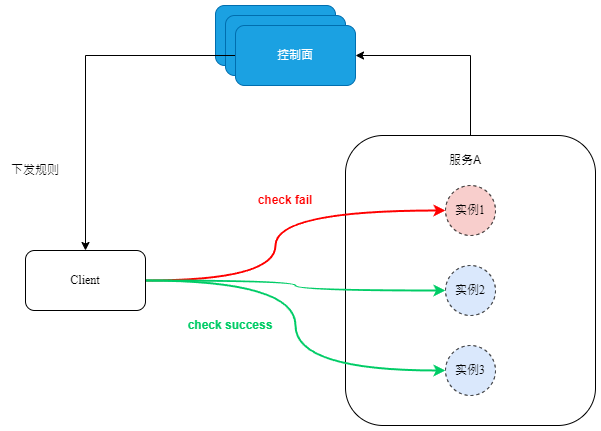

# 故障探测

[English](./faultdetector.md) | 简体中文

---

## 定义

故障探测，指的是主调方通过主动探测的机会，及时发现出现故障的被调端实例，并进行剔除，防止流量打到故障的实例导致业务出错。

## 故障探测场景

故障探测一般在以下场景需要使用到：

### 流量具备明显潮汐现象的服务

有部分的业务，流量一般在闲时会非常少，甚至没有流量，一旦出现忙时大规模的流量就会进来，出现故障的话会影响比较大。比如像会议系统，没有人开会的时候，会议服务都没有流量，一旦开会的时候，如果服务出现问题，会导致会议延期。这时候，需要在闲时也要进行主动探测，确保出问题的服务实例可以及时被剔除。

### 对故障剔除实时性要求较高的服务

有一些支付类的场景，对错误的容忍程度较低，一旦出现业务错误需要耗费成本去回滚。这时候，需要对这些关键的服务，进行实时探测，确保出问题时可以实现秒级剔除。

### 与注册中心之间的网络不稳定的服务

注册中心的健康检查也可以实现故障剔除的能力，但是， 假如注册中心和服务并不是部署在同一个网络区域，一旦出现了网络分区，会导致注册中心的健康检查失效。而故障探测行为发生在主调方和被调方之间，可以有效的避免网络分区导致探测结果不准确的问题。

## 故障探测的类型

实施故障探测，一般有以下3种类型：

### 四层探测

基于TCP，UDP的四层协议进行探测，目标是发现网络不可达、网络TTL较高等四层网络问题。

### 七层探测

基于HTTP, gRPC等七层协议进行探测，目标是发现业务服务的错误，比如业务进程挂死、业务逻辑出现致命故障、业务占用资源过高导致无法正常工作等问题。

### 存储层探测

针对数据库的探测，比如针对MySQL的探测，需要调用MySQL的ping接口来探测。

### 缓存探测

针对Redis等分布式缓存的探测，需要调用Redis的ping接口进行探测。

### 基于业务请求回包的探测

根据业务请求回包的成功失败，决定目标实例是否健康。

### 自定义探测

对于私有协议的服务，需要进行自定义协议的方式进行探测。

## 故障探测的过程

- 用户在控制面，配置哪些服务需要进行故障探测
- 主调方针对他曾经访问过的、并且开启了故障探测的服务进行探测，没有访问过的不进行探测。
- 按照对应的探测方式进行发包探测，一般是连续多次出现失败，就对实例进行隔离。
- 持续对实例进行探测，持续出现多次探测成功后，就解除隔离。



## 算法实现

### TCP探测

通过往目标的TCP端口，发送SYNC包，探测这个端口是否在监听，如果节点存在，但是端口没有监听则返回RST包。如果目标不可达，则SYNC包会超时。

```
apiVersion: polarismesh.cn/v1
kind: FaultDetector
metadata:
  name: fault-detect-rule
spec:
  matcher:
    service:
      operation: EXACT
      values:
      - testSvc
    method:
      operation: IN
      values:
      - foo
      - foo1
  mode: ON_RECOVER
  interval: 30
  timeout: 1
  detect_config:
  - @type:"faulttolerance.TCPDetector"
    connect_check: bool
```

### UDP探测

通过往目标的UDP端口，发送UDP报文，假如端口没有监听或者目标不可达，则会收到一个ICMP目标不可达的消息。

```
apiVersion: polarismesh.cn/v1
kind: FaultDetector
metadata:
  name: fault-detect-rule
spec:
  matcher:
    service:
      operation: EXACT
      values:
      - testSvc
    method:
      operation: IN
      values:
      - foo
      - foo1
  mode: ON_RECOVER
  interval: 30
  timeout: 1
  detect_config:
  - @type:"faulttolerance.UDPDetector"
    send: 0xEE
    receive:
    - 0xBB
    - 0xCD
```

 ### HTTP探测

 通过往目标发送HTTP报文，通过回包结果来决定目标健康状态。

- 收到RST包：端口未监听
- 报文超时：目标不可达（可能是网络分区）
- 收到5XX错误：目标服务出现异常

```
apiVersion: polarismesh.cn/v1
kind: FaultDetector
metadata:
  name: fault-detect-rule
spec:
  matcher:
    service:
      operation: EXACT
      values:
      - testSvc
    method:
      operation: IN
      values:
      - foo
      - foo1
  mode: ON_RECOVER
  interval: 30
  timeout: 1
  detect_config:
  - @type:"faulttolerance.HTTPDetector"
    path: /health
    headersToAdd:
      token: 123456
```

 ### gRPC探测

 通过往目标发送gRPC报文，通过回包结果来决定目标健康状态。目标服务需要实现[HealthCheckService](https://github.com/grpc/grpc/blob/master/doc/health-checking.md)

- 收到RST包：端口未监听
- 报文超时：目标不可达（可能是网络分区）
- 根据长链接状态，断链重连成功决定节点是否出现异常
- 收到Unavailable错误：目标服务出现异常

```
apiVersion: polarismesh.cn/v1
kind: FaultDetector
metadata:
  name: fault-detect-rule
spec:
  matcher:
    service:
      operation: EXACT
      values:
      - testSvc
    method:
      operation: IN
      values:
      - foo
      - foo1
  mode: ON_RECOVER
  interval: 30
  timeout: 1
  detect_config:
  - @type:"faulttolerance.GRPCDetector"
```